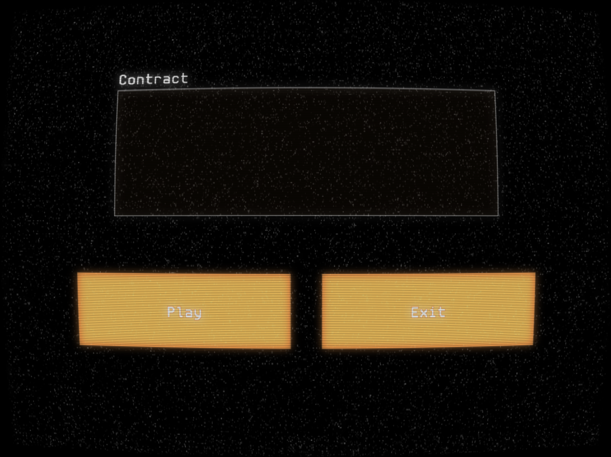

# Contract
You are in the future. The social contract has been rewritten. Who rewrote it? What is it now? Everyone in the world has a “conflict of interest” making it impossible to conduct trials the way we’re used to. You can’t communicate how you normally would, instead you are having a semi-direct conversation with another person through an interface. They tell you the “story” of something that has happened and ask if you understand it. Many of the details of the story don’t make sense to you and some words you don’t know. As you ask questions and traverse down a dialogue tree with your interface you realize that misunderstandings are everywhere. Things that mean one thing to you evidently mean another thing to the person on the other side and vice versa. Are they trying to obfuscate their purpose? Or is it all truly a misunderstanding? Are you in one of these future trials?

Itch Store Page: https://jacobpoteet.itch.io/contract

Game jammed for https://itch.io/jam/dialogue-jam-24

## How To Play
1. Download the latest release from the GitHub releases page
2. Extract the ZIP file to your desired location
3. Run `Contract.exe`
